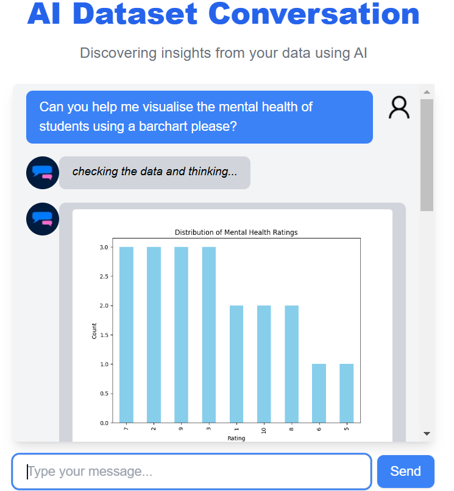
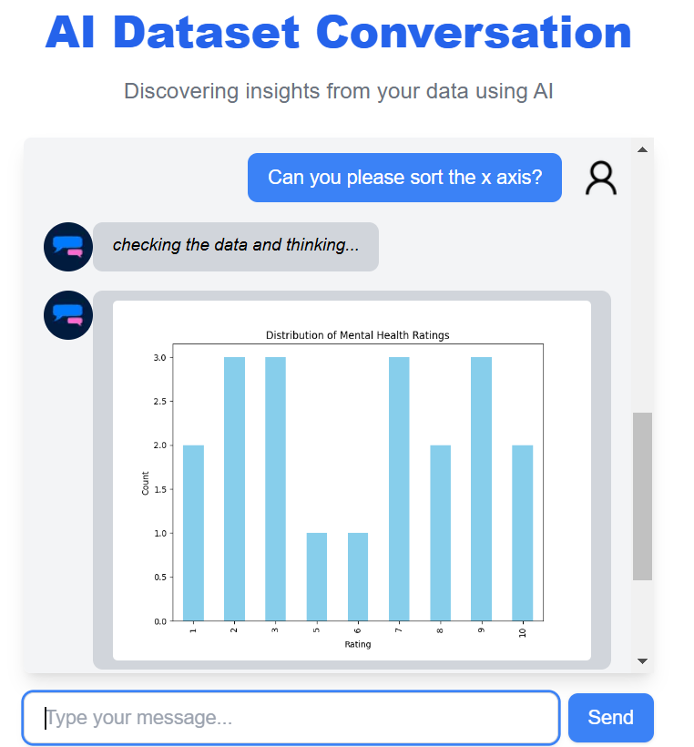

## Data Analysis and Visualisation Chatbot

#### **Core Features**

1. **User Input**:

   - Accept user queries in natural language.
   - Process queries to generate meaningful results based on the dataset.

2. **AI Integration**:

   - Utilises Gemini (using Vercel) to implement interactions with a LLM.
   - Tools created to process data and generate image responses
   - Concise but effective system prompts were written to allow for the LLM to act as an smart agent.

3. **Frontend**:
   
   - User friendly, minimalistic chatbot interface
   - Lightweight, and fast, using only Tailwind CSS.

4. **Backend**:

   - A backend service written in Python, using FASTAPI to handle data visualisation.

5. **Data Processing**:
   - To optimise image generation on the backend, the data was also pre-processed by the server as a dataframe

#### **Example Conversations**

1. **Basic Query**:


2. **Visualisation request**:
- Note: Sometimes, the chatbot illustrates the data without sorting it. To handle this, a follow-up prompt can be sent to the chatbot




### Problems encountered
### **Challenges Faced and Solutions**

#### **1. Visualizations and Images Not Supported by Vercel Natively**
- **Problem**: Vercel doesn’t natively support backend services for visualizations/images.
- **Solution**: 
  - Created a backend server using **FastAPI** to generate visualizations.
  - Process flow:
    1. User query sent to the backend server.
    2. Visualization generated and returned to the chatbot.
    3. Result displayed to the user in the chat interface.

---

#### **2. Chatbot Hallucinates and Struggles to Find Data**
- **Problem**: AI generated irrelevant/incorrect responses (hallucination) and struggled with ambiguous queries.
- **Solution**: 
  - **Custom Tools**: Developed `getTableData` and `getQuestions` to query the dataset directly.
  - **Improved Prompts**: Updated system prompts to clearly explain the dataset structure, helping the AI better understand and respond accurately.

---

#### **3. Results from API Calls Were Not Automatically Sent Back to Users**
- **Problem**: Tool results from API calls were not being sent back to users.
- **Solution**: 
  - Reviewed each step of the AI’s process to ensure tool outputs were captured.
  - Integrated tool results dynamically into the chatbot’s responses.
  - Ensured users received complete and accurate responses from tool queries.


### Limitations and planned enhancements
1. **Current limitations**
   - Dataset is not mutable, and preloaded. 
   - More complex operations on the data are not yet supported (e.g: wordCloud analysis etc)

2. **Planned Enhancements**
   - Implement tools to allow for data mutation
   - Support more elaborate data analysis using popular python libraries on backend


### Prerequisites

Before you begin, ensure you have Node.js installed on your machine. You can download it from [nodejs.org](https://nodejs.org/) or via [homebrew](https://formulae.brew.sh/formula/node) `brew install node` for Mac users.

### Setting Up the Project

1. **Fork and clone the project:**

   - **Fork the project**: Navigate to the repository on GitHub and click the "Fork" button at the top right corner. This will create a copy of the repository under your own GitHub account, allowing you to make changes without affecting the original project.

   - **Clone the repository**: Once you have forked the repository, clone it to your local machine. You can do this by clicking the "Code" button on your forked repository page, copying the URL, and running the following command in your terminal:
     ```bash
     git clone https://github.com/your-username/your-forked-repo.git
     ```
     Replace `your-username` with your GitHub username and `your-forked-repo` with the name of the repository you forked.

2. **Navigate to the project directory:**

   ```bash
   cd data-insights-chat
   ```

3. **Install the dependencies:**

   ```bash
   npm install
   ```

   You may encounter dependency warnings. You may ignore them for the time being.

4. **Run the back-end server:**
   ```bash
   cd data-insights-chat/visualization-server
   python server.py
   ```


5. **Run the development server:**
   ```bash
   npm run dev
   ```

6. **Open your browser and visit:**

   [http://localhost:3000](http://localhost:3000)

   You should see the application running.

---

### **Sample Dataset Explanation**

The dataset `responses.csv` provided with this project contains survey responses from university students about their academic stress and mental health management. Below are the headers and descriptions of each column in the dataset:

- **id**: A unique identifier for each response.

- **date**: The timestamp when the response was recorded.

- **What are the main sources of academic stress you experience as a university student?**: Open-ended response where students describe their main sources of academic stress.

- **How often do you feel overwhelmed by your academic workload?**: Selectable options indicating the frequency of feeling overwhelmed by academic workload. Options include: "Never", "Rarely", "Sometimes", "Often", "Always".

- **Which of the following strategies do you use to manage academic stress? (Select all that apply)**: Multiple selections indicating the strategies used by students to manage academic stress. Options include: "Exercise", "Meditation", "Time management", "Seeking help from friends", "Counselling services".

- **On a scale from 1 to 10, how would you rate your overall mental health during the academic year?**: Numeric response where students rate their overall mental health on a scale from 1 to 10.

- **What support services do you think would help improve your academic experience and mental health?**: Open-ended response where students suggest support services that could help improve their academic experience and mental health.
